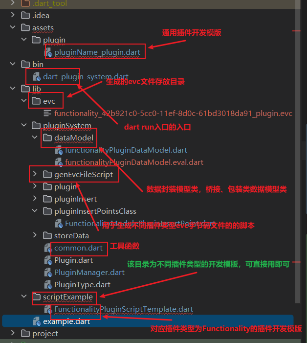
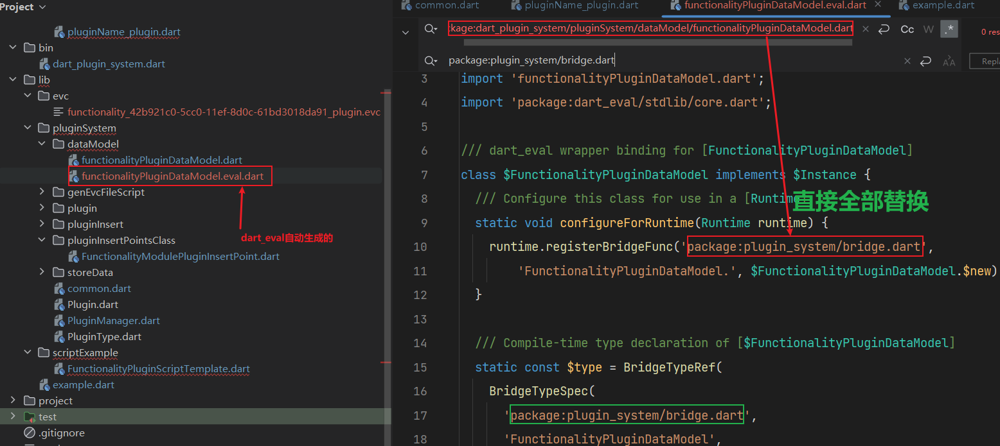
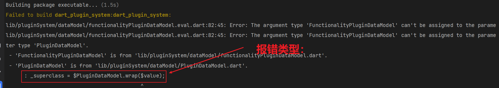
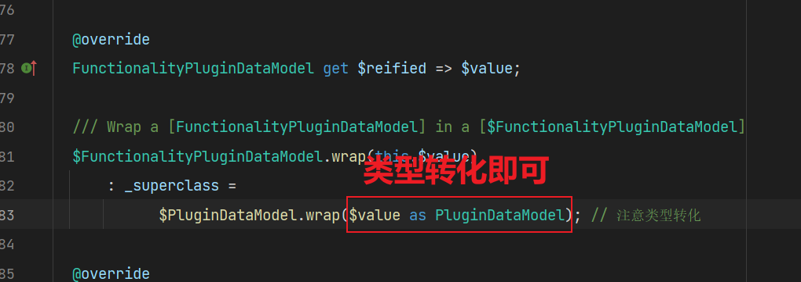
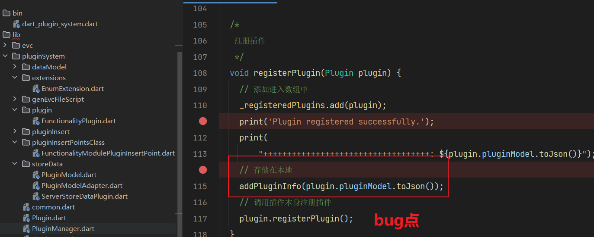
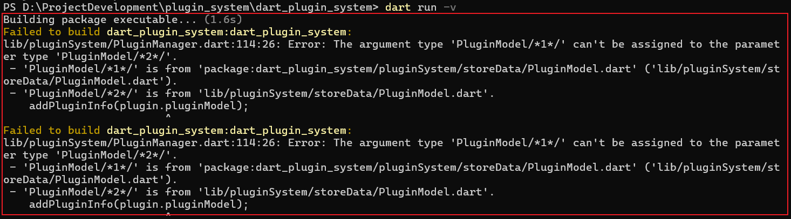

# 插件系统开发文档

## 插件类型介绍

### 1.**功能扩展类插件**

- **描述**: 这些插件通过添加新的功能或特性来扩展应用程序的核心功能。

- 示例

    - 浏览器插件（如广告拦截器、翻译工具）。
    - IDE插件（如代码格式化工具、调试工具）。
    - 文档编辑器插件（如拼写检查、模板管理）。

### 2. **集成类插件**

- **描述**: 这些插件允许应用程序与其他服务或工具集成，通常用于数据同步或外部服务调用。

- 示例

    - API集成插件（如支付网关、社交媒体分享）。
    - 数据库连接插件（如支持不同类型的数据库）。
    - 第三方服务集成（如邮件发送、云存储）。

### 3. **UI/UX类插件**

- **描述**: 这些插件通常用于改善用户界面的外观和用户体验，可能包括视觉增强和交互功能。

- 示例

    - 主题/皮肤插件（改变应用程序的外观）。
    - 自定义控件或小部件（如日历、图表）。
    - 动画效果插件。

### 4. **安全类插件**

- **描述**: 这些插件专注于增强应用程序的安全性，通常用于防止攻击或保护用户数据。

- 示例

    - 防火墙插件。
    - 安全扫描插件（如防止SQL注入、XSS攻击）。
    - 身份验证/授权插件。

### 5. **分析与监控类插件**

- **描述**: 这些插件用于收集、分析和监控应用程序的性能和使用情况。

- 示例

    - 性能监控插件（如内存使用、CPU消耗）。
    - 日志记录插件（如错误日志、访问日志）。
    - 分析工具集成（如Google Analytics插件）。

### 6. **内容管理类插件**

- **描述**: 这些插件用于管理应用程序中的内容，通常用于CMS（内容管理系统）中。

- 示例

    - SEO插件（搜索引擎优化）。
    - 多语言支持插件。
    - 媒体管理插件（如图片库、视频播放器）。

### 7. **开发工具类插件**

- **描述**: 这些插件主要用于开发阶段，帮助开发人员更高效地编码、测试和调试。

- 示例

    - 代码生成器插件。
    - 测试框架集成插件。
    - 持续集成插件。

### 8. **自动化类插件**

- **描述**: 这些插件用于自动化某些流程或任务，减少手动操作的需求。

- 示例

    - 构建工具插件（如Gradle、Maven插件）。
    - 部署自动化插件。
    - 测试自动化插件。

### 9. **数据处理类插件**

- **描述**: 这些插件用于处理和转换数据，通常用于数据导入/导出、格式转换等。

- 示例

    - 数据导入/导出插件（如CSV、JSON）。
    - 数据清理和转换插件。
    - 报告生成插件。

### 10. **通信类插件**

- **描述**: 这些插件支持应用程序与其他系统、服务或设备之间的通信。

- 示例

    - WebSocket插件。
    - 消息队列插件（如RabbitMQ、Kafka）。
    - 实时通信插件（如视频会议、聊天）。

### 10.微应用miniAPP

类似小程序独立运行的小型应用

## 项目目录

```markdown
├─assets
│  └─plugin     ----- 存放插件目录
├─bin            ----- 命令入口设置
├─lib
│  ├─evc        ------ 用于存放生成的.evc文件
│  ├─pluginSystem    ----- 插件系统核心目录
│  │  ├─dataModel   -----  数据封装模型目录（用户可自定义)
│  │  ├─genEvcFileScript   ----- 生成evc字节码文件脚本目录
│  │  ├─plugin             ----  实现不同插件类型的插件类文件
│  │  ├─pluginInsert	   ----  插件注入器核心类文件
│  │  ├─pluginInsertPointsClass  ---- 不同插件类型对应的插件注入类文件
│  │  └─storeData          ---- 有关存储的类实现文件
│  └─scriptExample          ----  插件开发例子目录，里面展示了不同插件类型开发的例子
├─project
│  ├─pluginSystem
│  └─README
└─test                      ---- 测试目录
```

## 使用方法

> 提示：插件系统集成与插件开发都是基于同一套代码进行的，因为他们是紧密联系捆绑的。

#### 插件系统与项目集成(面向项目)

* 下载源代码，建议选择最新版本

* 在你的dart(或flutter项目)中**新建一个目录用于存放克隆下来的lib目录代码**

* **安装相关依赖**: 

  ```yaml
  dependencies:
    dart_eval: ^0.7.9
    eval_annotation: ^0.7.0
    hive: ^2.2.3
    path: ^1.9.0
    uuid: ^4.4.2
  ```

* 开始集成：easy use!

  1. **初始化**: 注意尽量在启动应用时进行初始化，不要在使用插件系统时才进行初始化操作！

     ```dart
     // 获取当前执行环境的路径：可自定义
     final String directory = Directory.current.path;
     // 初始化Hive，设置存储路径
     Hive.init(directory);
     // 注册调制器
     // Hive.registerAdapter(PluginModelAdapter());
     // 初始化持久化存储插件列表
     await ServerStoreDataPlugin.initialize();
     ```
  
  2. **注册插件**并进行初始化
  
     ```dart
     // ************************前置操作：注册插件 and 初始化插件************************************
     print("注册和初始化插件完成");
     
     // 实例化中间处理模块化插件 继承至Plugin类
     FunctionalityPlugin functionalityPlugin = FunctionalityPlugin(
         category: PluginCategory.Integration, // 插件的对应的类别，枚举类型，具体类别见
         evc: true, // 是否为evc字节码
         path:   "D:\\ProjectDevelopment\\plugin_system\\dart_plugin_system\\lib\\evc\\functionality_42b921c0-5cc0-11ef-8d0c-61bd3018da91_plugin.evc", // 插件脚本的文件地址，注意要求有访问权限
         name: "插件名称" //插件名称
     );
     
     // 注册插件
     pluginManager.registerPlugin(functionalityPlugin);
     
     /*
       插件初始化:
       1.方式一：仅初始化该插件
       2.方式二: 初始化所有已注册插件：包括方式1和2
        */
     functionalityPlugin.initial(); // 方式1 推荐
     //pluginManager.initialAll(); // 方式2
     ```
  
  3. 使用**插件注入器注入**插件拓展位置
  
     ```dart
     pluginManager.pluginInjector // 获取注入器
         ..pluginType = PluginType.Functionality // 设置插件类型
         ..pluginCategory = PluginCategory.Integration // 设置插件类别
         ..data = FunctionalityPluginDataModel() // 传入插件处理数据模型，用户可自定义
         ..callback = (args) { // 回调处理函数
              // args传递过来的参数: 依次为args[0]、args[1].....
              // 需要使用工具函数getValueFrom$Value来结构出value值
             final firstValue = pluginManager.getValueFrom$Value(args, index: 0);
             print("回调处理: ${firstValue}");
         }  
         ..inputDataHandler = (data) {
             // 数据输入插件系统处理回调函数: 不处理应返回原数据
             print("输入数据处理");
             return data;
           }
         ..outputDataHandler = (data) {
             // 数据输出插件系统处理回调函数: 不处理应返回原数据
             print("输出数据处理");
             return data;
           }
     	..run(); // 运行插件
     ```

> **提示**：
>
> **集成难点解惑:** 因为集成的项目业务逻辑等大相径庭，因此很难统一封装一个数据实体模型用于dart环境与Eval环境进行数据模型交换，因此您可以根据你的项目自定义数据模型的类定义。
>
> 因此为了能方便能使插件系统与您的项目进行数据类型的转换衔接，因此您可能需要一个钩子让插件系统和您的项目无缝衔接的正常运行，您可能需要对进出插件系统的数据进行处理或转换，因此，系统专门留了两个钩子函数(input, output)以便您能处理数据转换的处理操作。
>
> 

#### 插件开发（面向插件端)

> 开发插件所需知识：（对于做过flutter开发的，其实也很简单的，只需要了解一下dart_eval即可,很多功能模块都已经封装好了，就像写普通业务逻辑一样)
>
> - 熟悉dart基本语法，如果设计flutter，还需要掌握flutter框架
> - 了解dart_eval，以及相关支持dart的语法或包，设计Ui还需要掌握了解flutter_eval的使用，尽量阅读一遍其基本原理。因为插件系统是基于dart_eval而进行开发的，因此务必请先了解掌握dart_eval的使用。
> - 掌握插件系统的基本原理，以及基本约束概念： pluginType,pluginCategory等

- 克隆该项目或下载其他版本
- 安装相关依赖
- 目录介绍



- 从入口函数entry()开始

  ```dart
  /*
   * 名称: 插件开发入口
   * 描述: 这是基于dart_eval的纯dart语言的插件开发系统，让开发者仅需掌握基本dart_eval使用规范和要求就能轻易集成到自己dart项目中
   , 轻松完成code pull, 功能模块动态拓展等业务场景。后续会开发拓展到flutter项目中。
   * 作者: xskj
   * version: v1.0.0
   * github: https://github.com/gnu-xiaosong
   * 创建日期: 2024-08-16
   * @parameters:
       dataModel    dynamic    插件所需要处理的数据模型对象，可自定义，也可使用官方编写好的常用数据体封装模型
       callback     FUnction   回调函数，主要用途为，方便扩展实现在Eval环境中不支持的功能业务场景，比如执行第三方拓展包的功能
                               使用步骤:
                               * 1. 在插件注入点定义callback回调函数理逻辑，以便编写插件时直接在Eval环境中调用即可。
                               * 2. 在插件脚本[即本文件]中根据业务需求调用即可
   * @return:
       dataModel    dynamic/null   返回参数为输入参数数据封装模型类型，可为空[具体区别参见系统设计部分文档]
   * 构建: 对于插件的构建方式有两种方式：
            1. 源代码: 导入.dart的源代码文件, 运行时编译，不推荐, 速度慢，影响性能
            2. evc字节码: 先将源代码编译成evc字节码，在dart运行时直接执行，推荐，速度较快，具体构建evc字节码参见文档构建evc部分，或者阅读dart_eval文档
   * 其他说明: 为了方便开发者专注于业务场景的实现，本插件系统已实现了两种构建方式，具体使用参见【构建部分】，直接使用相关插件模版即可快速开发
   * 注意: 在使用插件系统开发时,一定要注意插件的版本对应!!
   * 调试：为了方便开发者熟悉插件的执行流程, 在xxx文件夹内有个xxx测试用例，供开发者调试
   */
  
  // 导入Eval环境中会用到的相关类: 提示在ide中会报错，不用管
  import 'package:plugin_system/bridge.dart';
  
  /*
  插件的入口函数: 名称不能修改
   */
  entry(dynamic dataModel, Function callback) {
    /// .................插件的业务实现............................
    /// 返回值说明：
    /// 如果没有返回值则请返回 null
    /// 否则请使用定义好的数据类模型进行封装再返回并且输入数据与输出数据模型类应当统一，以便插件的链式操作处理
  
    // 使用数据体进行重新封装: 一定要重新封装
    print("In the eval environment input data: ${dataModel.id}");
    callback('我是从Eval环境中出力得到的');
    // 返回数据类型为数据封装体模型的包装类warp, 带$的, 例如: $FunctionalityPluginDataModel
    return dataModel ?? null;
  }
  ```

> 提示: 如何您需要需要拓展Eval环境中的类，支持您通过自定义编写桥接或者包装器进行拓展，具体可见dart_eval官方文档使用，推荐使用给所需类加上@bind(),然后运行命令`dart_eval bind`自动生成。注意生成的包名需要进行替换，如下所示:
>
> 

##### 插件导入包示例（可自定义）

> 目的：为了统一插件包标准，这里提供一个插件包示例

* 包内容:

  1. dart或evc脚本文件

  2. 插件详情信息: info.json 具体字段如下

     ```json
     {
       "name": "SamplePlugin",
       "version": "1.0.0",
       "author": "John Doe",
       "description": "This is a sample plugin that provides basic functionality.",
       "license": "MIT",
       "homepage": "https://example.com/sample-plugin",
       "repository": "https://github.com/example/sample-plugin",
       "dependencies": {
         "flutter": ">=2.0.0 <3.0.0",
         "http": "^0.13.3"
       },
       "pluginType": "FunctionalityPlugin",
       "supportedPlatforms": ["android", "ios", "web"],
       "lastUpdated": "2024-08-20T12:34:56Z",
       "additionalInfo": {
         "apiVersion": "2.1",
         "minSdkVersion": 21,
         "maxSdkVersion": 30
       }
     }
     ```

* 打包格式: xxx.plugin   

  具体操作方法：将两个文件先合一起打包成.zip文件，然后修改后缀为.plugin即可

  获取则反向操作即可。

## 插件系统设计


* 插件管理器


* 注入器架构图


### 插件管理类设计：PluginManager

#### 功能

- 注册插件:register
- 注销已注册的插件:unregister
- 获取已注册的插件:getPlugin
- 初始化所有已注册的插件: initialAll
- 释放所有已注册的插件：disposeAll

##### dart语言实现：

```dart
/*
插件管理器
 */
class PluginManager {
  /*
  注册插件
   */
  registerPlugin() {
    //
  }

  /*
  注销插件
   */
  unregisterPlugin() {
    //
  }

  /*
  获取已注册的插件
   */
  getPlugin() {
    //
  }

  /*
  初始还所有已注册的插件
   */
  initialAll() {
    //
  }

  /*
  释放所有已注册插件
   */
  disposeAll() {
    //
  }
}
```

### 插件类设计：Plugin

#### 属性

* 插件唯一性ID: id

- 插件名称: name
- 插件类型: type

#### 方法

- 初始化: initial
- 释放插件: dispose

#### dart语言实现

插件枚举类型

- PluginType.dart

```dart
enum PluginType {
  Functionality,
  Integration,
  UI,
  Security,
  Analytics,
  ContentManagement,
  DevelopmentTools,
  Automation,
  DataProcessing,
  Communication,
  miniApp
}
```

- Plugin.dart

```dart
/*
插件类:抽象类接口
 */
import 'PluginType.dart';

abstract class Plugin<T extends PluginType> {
    
  // 插件ID：唯一性标识
  String get id;

  // 插件名称
  String get name;

  // 插件类型: 采用枚举类型T
  T get type;

  // 启用状态
  bool get status;
    
    
  /*
  抽象实现接口1: 注册插件
   */
  registerPlugin() {
    //
  }

  /*
  抽象实现接口2:: 注销插件
   */
  dispose() {
    //
  }
}
```

### 插件存储设计

#### 应用运行过程插件存储设计

* app启动过程中从**本地化存储**中**获取**插件列表**
* 将本地化存储中取出的插件列表进行注册，同时单例实例化插件管理器为全局单例对象，在GlobalManager全局中进行初始化
* 然后即可调用插件注入点管理器进行管理和运行

#### 应用未运行过程插件存储设计

* 采用Hive能封装对象Object进行对象持久化存储在本地
* 对于Object对象设计
    1. 插件名称:  name
    2. 插件类型：pluginType
    3. 插件类别：pluginCategory
    4. 插件evc的加载路径：path
    5. 插件创建的日期: time
    6. 插件状态:status


### 插件注入点设计

#### 插件注入点抽象类

```dart
/*
插件注入点抽象类
 */

import 'package:socket_service/microService/pluginSystem/Plugin.dart';
import 'package:socket_service/microService/pluginSystem/PluginType.dart';
import 'PluginInsertPointType.dart';

abstract class PluginInsertPoint<T extends ConPluginType,
    Z extends PluginType> {
  // plugin插件类型: PluginType
  Z get type;

  // 串并联控制类型
  T get pluginConnType;

  // 已注册的插件: 用于使用插件
  List<Plugin> get pluginAll;
}
```


### 插件注入段代码示例

```dart
import 'dart:io';
import 'package:dart_plugin_system/pluginSystem/PluginManager.dart';
import 'package:dart_plugin_system/pluginSystem/PluginType.dart';
import 'package:dart_plugin_system/pluginSystem/plugin/FunctionalityPlugin.dart';
import 'package:dart_plugin_system/pluginSystem/pluginInsert/PluginCategory.dart';
import 'package:hive/hive.dart';
import 'pluginSystem/storeData/PluginModelAdapter.dart';
import 'pluginSystem/storeData/ServerStoreDataPlugin.dart';

main() async {
  // 初始化Hive
  // 获取当前执行环境的路径
  final String directory = Directory.current.path;
  // 初始化Hive，设置存储路径
  Hive.init(directory);
  // 注册调制器
  Hive.registerAdapter(PluginModelAdapter());
  ServerStoreDataPlugin().initialHiveParameter();

  // 实例化一个插件管理器实例单例对象
  PluginManager pluginManager = PluginManager();

  // ************************前置操作：注册插件 and 初始化插件************************************
  print("注册和初始化插件完成");

  // 实例化中间处理模块化插件 继承至Plugin类
  FunctionalityPlugin functionalityPlugin = FunctionalityPlugin(
      category: PluginCategory.Integration,
      evc: false,
      path:    "D:\\ProjectDevelopment\\plugin_system\\dart_plugin_system\\assets\\plugin\\pluginName_plugin.dart",
      name: "testPlugin");

  // 注册插件
  pluginManager.registerPlugin(functionalityPlugin);

  /*
  插件初始化:
  1.方式一：仅初始化该插件
  2.方式二: 初始化所有已注册插件：包括方式1和2
   */
  functionalityPlugin.initial(); // 方式1 推荐
  pluginManager.initialAll(); // 方式2

  // 插件流程化测试
  {
    // 步骤一: 原料
    String a = "石材";
    print("-------------step 1: $a");

    // 步骤二: 中间产物(插件化) 注入点
    /// 一行代码即可使用插件
    print("-------------step 2");
    pluginManager.pluginInjector // 获取注入器
      ..pluginType = PluginType.Functionality // 设置插件类型
      ..pluginCategory = PluginCategory.Integration // 设置插件类别
      ..data = "石头"  // 输入数据
      ..run(); // 运行注入器

    // 步骤三: 成品
    String c = "房子";
    print("-------------step 3: $c");
  }

  // *******************exit application***************************
  print("释放插件成功");
  // 释放插件
  functionalityPlugin.dispose();
  pluginManager.disposeAll();
}
```
运行结果:


### 具体插件实现开发文档

#### 插件类型


#### 插件类别


#### 目录说明


#### 开发须知

##### 插件运作流程说明


##### 其他说明

- 因为插件的运行时执行脚本归功于dart_eval, 因此建议先查阅dart_eval文档再进行插件的开发，以便少走弯路

  同理flutter插件拓展部分，请参见flutter_eval（基于dart_eval）文档
  
- 在使用`dart_eval bind`命令生成包装器类时，记得需要对其进行修改，将生成的包装器类中的包名替换为: `package:plugin_system/bridge.dart`

   

  否则会报错: `not find 'package:dart_plugin_system/pluginSystem/dataModel/PluginDataModel.dart'`等错误,这是由于相关类没有映射到lib库中，因此找不到。

#### 开发步骤

1. 先**阅读插件流程说明**，非必要，做到心中有数，以便更好更高效的开发插件

2. **确开发插件类型以及开发插件的类别**，以便精准定位查件的拓展位置，具体**类型**和**类别**见文档

3. 根据如下**给定的模版进行编写代码**，**入口**函数为**entry**, 需要参数【可选，依据不同业务场景实现】

    - 输入参数：可选，为提前封装的数据类【或者自定义】,如果不想麻烦可以使用官方封装的数据类模型
    - 输出参数：可选，不输出请返回null
        - 返回为null, 则表示该插件只利用数据类进行处理，不影响插件后续正常代码的执行结果
        - 返回not null, 则返回的参数将会传递给后续执行的操作，可能为next plugin 或者 进行过输出数据处理传递给后续代码的处理执行

   ```dart
   /*
   入口函数:
   输入数据： data实例化桥接类, 这里数据对象类需要根据不同业务场景实现，但可以抽象成一个接口，拱具体实现，
   注意由于数据模型类需要在eval中调用，因此要符合规范
   输出数据:  正常为同输入统一桥接类
    */
   dynamic? entry(dynamic dataModel) {
     final timeTracker = MyWorldTimeTracker();
     final myTime = timeTracker.getTimeFor(country);
   
     print(country +
         ' timezone offset: ' +
         myTime.timezoneOffset.toString() +
         ' (from Eval!)');
   
     return timeTracker;
   }
   ```

4. **编写数据模型类**（真实dart环境中的)：封住成数据类以便Eval环境与真实dart环境的数据传递及交换

   你可以这么简单理解：插件相当于一个黑箱，插件管理系统只负责将封装好的数据模型类传递给插件，黑箱操作相当于利用传递的数据模型对象进行业务开发，具体返回的数据，根据具体的插件业务场景需求，返回为null则不对后续本机代码产生影响，否则将会将插件处理返回的数据模型对象给后续本机代码进行处理。

   > 注意：dataModel目录即为定义的数据模型类文件存放目录，用户可以自定义，但要实现或继承数据模型类DataModel类，以便插件管理器能统一进行操作。
>
>

5. 在插件**编写**脚本中编写对应步骤4中的**适用于Eval环境中的数据模型类**，具体编写方法见如下，或者查阅dart_eval官方文档！！！！！！如果编译脚本出现问题，一定请查阅dart_eval官方支持语言模块文档，以免影响插件开发的进度。

6. **确定插件编译方式**: .evc字节码文件 或 .dart源代码文件，为了提高性推荐提前编译成evc字节码文件

   如果要编译成.evc字节码文件,推荐使用cli进行编译:

    1. 全局启用cli：`dart pub global activate dart_eval`

    2. 开始编译dart项目：

       ```shell
       cd my_project
       dart_eval compile -o program.evc
       ```
7. **得到脚本文件**：xxx.evc 或 xx.dart


### dart_eval手册

#### 源代码执行方式

两种都支持

* **编译成evc字节码文件**：速度快、需要提前编译、源代码安全性高
* **runtime时编译再执行**：方便、速度慢

#### 互操作

由于**包装器**互操作性能高且操作性强，因此推荐使用

##### 包装器三步走

1. 给出一个真实dart中的类定义

   ```dart
   import 'package:dart_eval/dart_eval.dart';
   import 'package:dart_eval/dart_eval_bridge.dart';
   import 'package:dart_eval/dart_eval_extensions.dart';
   
   /// 想要去包装的类
   class Book {
     Book(this.pages);
     final List<String> pages;
    
     String getPage(int index) => pages[index];
   }
   ```

2. 使用包装器实现对$instance接口的实现，即给出编译时类的定义(在eval环境中的类)。重写$getProperty、$setProperty 和$getRuntimeType，允许Eval环境访问类中的属性和方法

   ```dart
   /// 包装器的类
   class $Book implements $Instance {
     /// 为dart_eval编译器创建一个类型说明
     static final $type = BridgeTypeSpec('package:hello/book.dart', 'Book').ref;
   
     /// 为dart_eval编译器创建一个类声明
     static final $declaration = BridgeClassDef(BridgeClassType($type),
       // 构造函数                                
       constructors: {
         // 用空字符串定义默认构造函数
         '': BridgeFunctionDef(returns: $type.annotate, params: [
           'pages'.param(CoreTypes.string.ref.annotate)
         ]).asConstructor
       },
       // 方法
       methods: {
          // getPage方法
         'getPage': BridgeFunctionDef(
           returns: CoreTypes.string.ref.annotate,
             // 参数int index
           params: ['index'.param(CoreTypes.int.ref.annotate)],
         ).asMethod,
       }, wrap: true);  // wrap为true包装器类型
   
     /// 重写$value和$reified以返回值
     @override
     final Book $value;
   
     @override
     get $reified => $value;
     
     /// 创建包装Book类的构造函数
     $Book.wrap(this.$value);
     
     static $Value? $new(
       Runtime runtime, $Value? target, List<$Value?> args) {
       return $Book.wrap(Book(args[0]!.$value));
     }
   
     /// 为属性和方法getter创建包装器
     @override
     $Value? $getProperty(Runtime runtime, String identifier) {
       if (identifier == 'getPage') {
         return $Function((_, target, args) {
           return $String($value.getPage(args[0]!.$value));
         });
       }
       return $Object(this).$getProperty(runtime, identifier);
     }
   
     ///为属性设置器创建包装器
     @override
     void $setProperty(Runtime runtime, String identifier, $Value value) {
       return $Object(this).$setProperty(runtime, identifier, value);
     }
   
     /// 允许运行时类型查找
     @override
     int $getRuntimeType(Runtime runtime) => runtime.lookupType($type.spec!);
   }
   ```

3. 使用

   ```dart
   /// 现在我们可以使用dart_eval!
   void main() {
     // 实例化一个编译器对象
     final compiler = Compiler();
      
     // 定义一个桥接类: $Book
     compiler.defineBridgeClass($Book.$declaration);
     
     // 开始编译程序
     final program = compiler.compile({
         // 包名
         'hello' : {
             // 文件名和对应源程序
       'main.dart': '''
         import 'book.dart';
         void main() {
           final book = Book(['Hello world!', 'Hello again!']);
           print(book.getPage(1));
         }
       '''
     }});
   
     // 获取源程序的运行时
     final runtime = Runtime.ofProgram(program);
       
     // 在运行时中注册静态方法和构造函数
     runtime.registerBridgeFunc('package:hello/book.dart', 'Book.', $Book.$new);
     
     // 运行时执行包中的程序
     runtime.executeLib('package:hello/main.dart', 'main'); // -> 'Hello again!'
   
   ```

> 提示：有个实验性的项目，包装器的绑定生成。从 v0.7.1 开始，dart_eval CLI 包含一个实验性的包装器绑定生成器。它可在项目中使用 调用`dart_eval bind`，并将为所有使用 eval_annotation 包中的 @Bind 注释的类生成绑定。您还可以传递“--all”标志来为项目中的所有类生成绑定。请注意，生成的绑定并不支持所有边缘情况，可能需要手动调整。
>
> 绑定生成目前无法直接创建 JSON 绑定，但您可以使用生成的 Dart 绑定通过 创建 JSON 绑定`BridgeSerializer`。


## 错误排查

- 报错内容：在利用dart_eval的实验性性生成包装器时

  

  原因：继承类问题，方法：需as进行类型转化

  

- 修复store本地存储，删除Hive调制器，将本地存储插件列表元素由自定义PluginModel修改为Map类型，相比于性能推荐使用Hive自定义对象,由于出现未知bug，为了暂时实现存储，暂时采用此方案，后期可能会进行性能优化后进行修复

   **报错内容:**

## 插件实现日志记录

### 1.**功能扩展类插件**

- **2024.8.17**    修复核心bug，整理项目结构和文档修改， 提交版本v1.0.0 
- **2024.8.18**    修复store本地存储，删除Hive调制器，将本地存储插件列表元素由自定义PluginModel修改为Map类型，相比于性能推荐使用Hive自定义对象,由于出现未知bug，为了暂时实现存储，暂时采用此方案，后期可能会进行性能优化后进行修复
- 2024.8.20  添加插件导入包示例

### 2. **集成类插件**


### 3. **UI/UX类插件**


### 4. **安全类插件**


### 5. **分析与监控类插件**


### 6. **内容管理类插件**


### 7. **开发工具类插件**


### 8. **自动化类插件**


### 9. **数据处理类插件**


### 10. **通信类插件**


### 11.微应用

